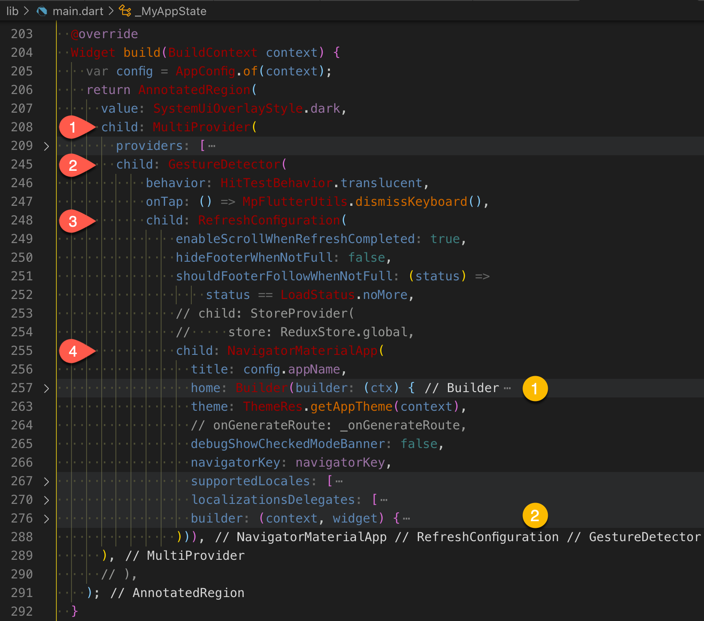

[OKToast的介绍](https://www.kikt.top/posts/flutter/toast/oktoast/)

## 代码结构分析

- 向外导出：oktoast.dart  
- 主实现代码：src/core/toast.dart  
- 分实现代码：src/widget/oktoast.dart  

## OKToast

src/widget/oktoast.dart 中定义了有状态的 widget —— `OKToast`。

```
class OKToast extends StatefulWidget {
  /// Usually should be [MaterialApp] or [CupertinoApp].
  final Widget child;

}
```

### 实现分析

和 [fan2/flutter_easyloading](https://github.com/fan2/flutter_easyloading) - FlutterEasyLoading 一样，`_OKToastState`.*build* 也还是基于 Overlay 实现。

**注意**：主实现代码中引入 material.dart 时隐藏了默认的 Overlay,OverlayEntry，因为自带了一份 lib/src/widget/overlay.dart？

```
// src/core/toast.dart
import 'package:flutter/material.dart' hide Overlay, OverlayEntry;
```

1. OverlayEntry 的 builder 返回 `widget.child`，然后封装为 Overlay` overlay`；  
2. 通过 Directionality 包裹 overlay 作为 child 构造 `Widget w`；  
3. 传入上一步的 w 构造返回 `_ToastTheme`（继承自 InheritedWidget）。  

```Dart
// src/widget/oktoast.dart

part of '../core/toast.dart';

class _OKToastState extends State<OKToast> {

  @override
  void dispose() {
    _contextMap.remove(this);
    super.dispose();
  }

  @override
  Widget build(BuildContext context) {
    var overlay = Overlay(
      initialEntries: [
        OverlayEntry(
          builder: (ctx) {
            _contextMap[this] = ctx;
            return widget.child;
          },
        ),
      ],
    );

    TextDirection direction = widget.textDirection;

    Widget w = Directionality(
      child: overlay,
      textDirection: direction,
    );

    return _ToastTheme(
      child: w,
      // ...
    );
  }

}
```

`_contextMap` 为 HashMap，记录了 _OKToastState 到 BuildContext 的映射。

```Dart
// src/core/toast.dart
LinkedHashMap<_OKToastState, BuildContext> _contextMap = LinkedHashMap();
```

### 全局初始化

**OKToast** 包裹 `MaterialApp` 作为其 child 参数，注意不是包裹 `Scaffold`！！！

一般情况下，一个 flutter 应用应该只有一个 MaterialApp（或是 `WidgetsApp`/`CupertinoApp`)。  
这里包裹后，可以缓存 APP 的主 Context 到内存中，后续再调用 *showToast* 显示时，不用传入 BuildContext。  
这样能满足一些无 context 场景的弹 toast 需求，例如调试网络层等纯逻辑模块。  

```Dart
OKToast(
  /// set toast style, optional
  child: MaterialApp()
);
```

在 [flutter OKToast使用](https://www.jianshu.com/p/dbe93eadfc85) 中，OKToast 包裹 _MyAppState.build 的第一个 child。


在以下应用的 _MyAppState.build 中，OKToast 考虑包裹 `child: NavigatorMaterialApp` 初始化。



> 如果仅仅是为了传递一个 context，可以考虑设计一个 init 或 setContext 接口，用于在 _MyAppState.build 中传递 BuildContext。

## 核心接口

- showToast  
- showToastWidget  

`showToast` 接口，没有设定的参数默认读取 _ToastTheme；内部创建 *widget* 后传参调用 `showToastWidget`。

> 后续在一些子级页面中调用 *showToast* 时，也可传入界面的 `context` 作为当次弹toast的 BuildContext。

### showToastWidget

**showToastWidget** 核心实现如下：

1. 构建 `OverlayEntry`：IgnorePointer-Directionality-*_ToastContainer* 实现；  
2. 将 OverlayEntry 封装为` ToastFuture`，并插入到 OverlayState；  
3. 将 ToastFuture 添加到 `ToastManager` 并返回，可通过返回的 ToastFuture 关闭。  

```Dart
// lib/src/core/toast.dart

/// show [widget] with oktoast
ToastFuture showToastWidget(
  Widget widget, {
  BuildContext? context,
  Duration? duration,
  ToastPosition? position,
  VoidCallback? onDismiss,
  bool? dismissOtherToast,
  TextDirection? textDirection,
  bool? handleTouch,
  OKToastAnimationBuilder? animationBuilder,
  Duration? animationDuration,
  Curve? animationCurve,
}) {
  context ??= _contextMap.values.first;
  OverlayEntry entry;
  ToastFuture future;
  final theme = _ToastTheme.of(context);

  // ...

  entry = OverlayEntry(builder: (ctx) {
    return IgnorePointer(
      ignoring: !handleTouch!,
      child: Directionality(
        textDirection: direction,
        child: _ToastContainer(
          duration: duration!,
          position: position!,
          movingOnWindowChange: movingOnWindowChange,
          key: key,
          child: widget,
          animationBuilder: animationBuilder!,
          animationDuration: animationDuration!,
          animationCurve: animationCurve!,
        ),
      ),
    );
  });

  dismissOtherToast ??= theme.dismissOtherOnShow;

  if (dismissOtherToast == true) {
    ToastManager().dismissAll();
  }

  future = ToastFuture._(entry, onDismiss, key, animationDuration);

  future.timer = Timer(duration, () {
    future.dismiss();
  });

  Overlay.of(context)?.insert(entry);
  ToastManager().addFuture(future);

  return future;
}
```

### ToastContainer

`_ToastContainer` 传入了 ToastPosition 内部排版。

### ToastTheme

如果没有全局初始化 OKToast，而是通过 showToast 传入 context，则 _ToastTheme.of(context) 将返回默认的 `_ToastTheme defaultTheme`。

```Dart
// lib/src/widget/theme.dart

part of '../core/toast.dart';

class _ToastTheme extends InheritedWidget {

  static _ToastTheme of(BuildContext context) =>
      context.dependOnInheritedWidgetOfExactType<_ToastTheme>() ?? defaultTheme;
}
```

### ToastFuture

**ToastFuture** 记录了 OverlayEntry 和 GlobalKey<`__ToastContainerState`> 以及 dismiss 回调 VoidCallback。

> dismiss 接口中调用 `_entry.remove()` 移除 toast。

**ToastManager** 中的集合 Set<ToastFuture> 存储了所有的 toast，主要是支持 dismissAllToast - ToastManager().dismissAll 关闭所有弹出的 toast。

## 其他参考

[Flutter——OKToast的使用](https://juejin.cn/post/6844903943458258951)

[flutter_styled_toast](https://pub.dev/packages/flutter_styled_toast) fork [github](https://github.com/fan2/flutter_styled_toast)
